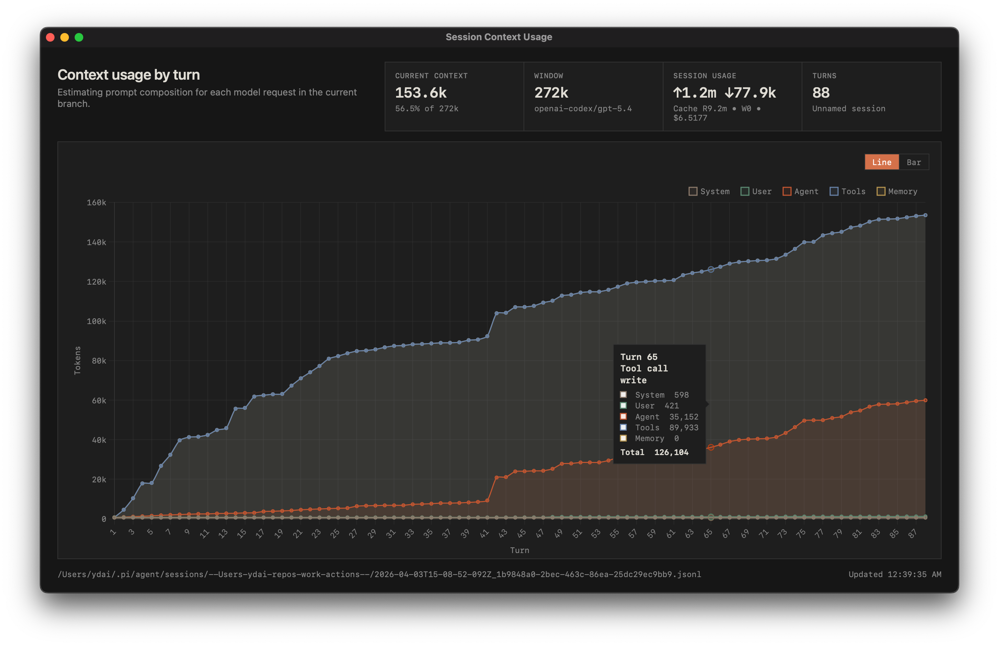

# pi-stuff

My small collection of [pi](https://github.com/badlogic/pi-mono) extension packages, only made possible by the incredible work of art from Mario.

Available packages:
- `@baggiiiie/pi-codex-usage`: shows Codex usage with a command and status widget
- `@baggiiiie/pi-context-chart`: opens a live context usage chart to see which turn blew up current context window
- `@baggiiiie/pi-context-status`: shows current context-window usage in Pi's status line or a custom footer
- `@baggiiiie/pi-no-ansi`: keeps pi `bash` tool output clean for the model by disabling color and stripping ANSI escapes
- `@baggiiiie/pi-rtk-rewrite`: proxies pi `bash` tool calls through [rtk](https://github.com/rtk-ai/rtk) before execution

## Install 

Install all packages:
```bash
pi install git:github.com/baggiiiie/pi-stuff
```

or individually:

```bash
pi install npm:@baggiiiie/pi-context-chart
pi install npm:@baggiiiie/pi-context-status
pi install npm:@baggiiiie/pi-no-ansi
pi install npm:@baggiiiie/pi-rtk-rewrite
pi install npm:@baggiiiie/pi-codex-usage
```

## Packages

### `@baggiiiie/pi-context-chart`

Adds a live context usage chart in a native Glimpse window.



Commands:

```text
/context-chart
/context-chart close
```

Install individually:

```bash
pi install npm:@baggiiiie/pi-context-chart
```

Notes:
- Requires `glimpseui` to be installed where Node can resolve it, or `GLIMPSE_PATH` set to `.../glimpseui/src/glimpse.mjs`.

### `@baggiiiie/pi-context-status`

Shows the current context window in Pi's status area, including an estimated breakdown by system/user/assistant/tools/memory.

Commands:

```text
/context-status status
/context-status footer
/context-status off
/context-status refresh
/context-status help
```

Install individually:

```bash
pi install npm:@baggiiiie/pi-context-status
```

Notes:
- Defaults to compact `status` mode on session start.
- Set `PI_CONTEXT_STATUS_MODE=footer` for an expanded custom footer.
- Falls back to a local estimate right after compaction until Pi has fresh context usage again.

### `@baggiiiie/pi-codex-usage`

Adds a Codex usage command and status widget.


Commands:

```text
/codex-usage
/codex-usage refresh
/codex-usage clear
/codex-usage help
```

Install individually:

```bash
pi install npm:@baggiiiie/pi-codex-usage
```

Notes:
- Run `/login` in Pi and choose ChatGPT Plus/Pro (Codex) before using the default endpoint.
- Refreshes in the background every 5 minutes by default.
- Multiple Pi sessions share a small temp-file cache.


### `@baggiiiie/pi-no-ansi`

Keeps pi `bash` tool output cleaner for the model by disabling common color env settings and stripping ANSI escapes from captured output.

Install individually:

```bash
pi install npm:@baggiiiie/pi-no-ansi
```

Notes:
- Only affects pi `bash` tool calls.
- Intentionally minimal: no commands, no UI, and no command-specific flag rewriting.

### `@baggiiiie/pi-rtk-rewrite`

Rewrites Pi `bash` tool calls through [RTK](https://github.com/rtk-ai/rtk) before execution.


Commands:

```text
/rtk-rewrite
/rtk-rewrite status
/rtk-rewrite on
/rtk-rewrite off
/rtk-rewrite refresh
/rtk-rewrite test git status
```

Install individually:

```bash
pi install npm:@baggiiiie/pi-rtk-rewrite
```

Notes:
- Install RTK separately and make sure `rtk rewrite` works in your shell.
- Only Pi `bash` tool calls are rewritten.
- If RTK fails or has no rewrite, the original command still runs.
